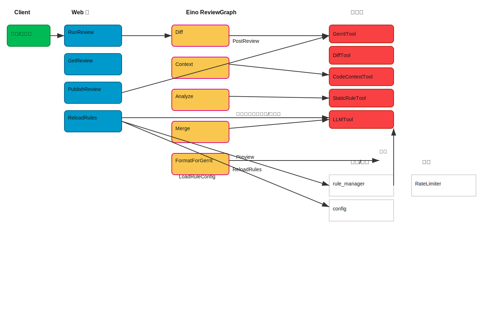
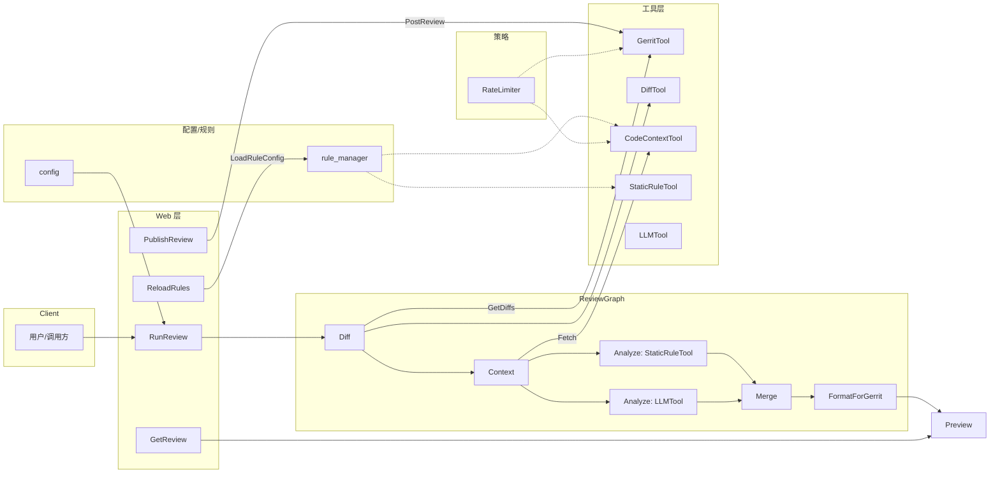
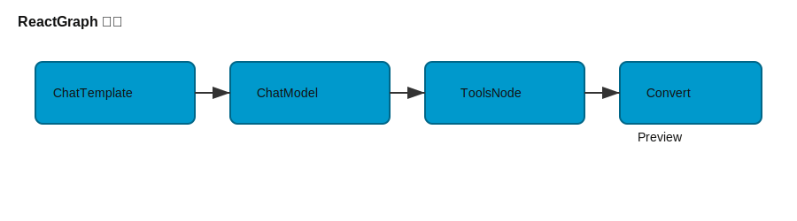
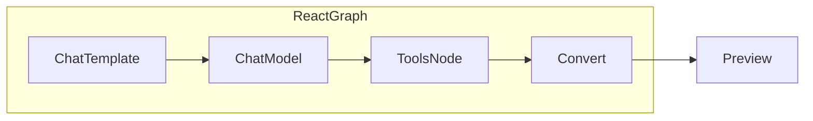
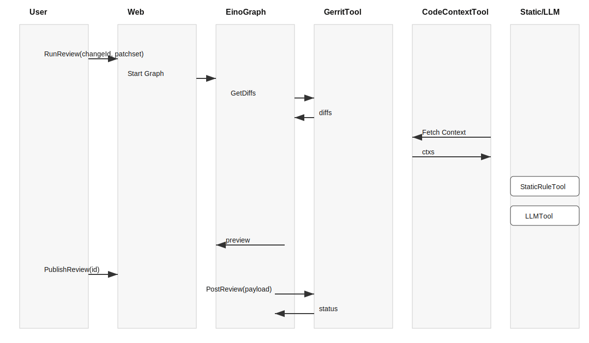
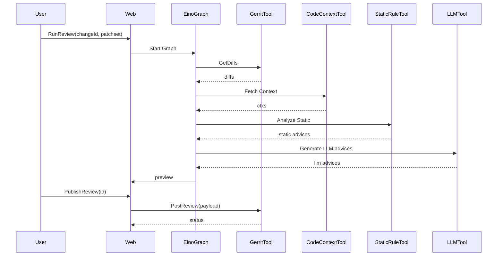

# 项目技术架构图（更新版）

## 组件概览

- Web 层：`internal/web`
  - `handler_reviews.go` 提供评审触发、结果查询、发布接口
  - `handler_config.go` 提供规则热重载接口（已安全加固）

- Eino 编排：`internal/app/eino`
  - `eino_flow.go` 定义两套编排：ReviewGraph（批处理）与 ReactGraph（ReAct 工具调用）

- 工具与分析：`internal/app/tools`
  - `GerritTool` 访问 Gerrit 变更与文件
  - `DiffTool` 解析补丁
  - `CodeContextTool` 拉取上下文（函数/类/依赖/文件）
  - `StaticRuleTool` 执行静态规则
  - `LLMTool` 生成建议（轻量模型）
  - `FormatForGerrit` 合并并格式化输出

- 配置与规则：`internal/config`
  - `config.go` 读取运行时配置
  - `rule_manager.go` 规则模型与热重载（字段白名单 + 目录限制）

- 调度与策略：`internal/app/scheduler`, `internal/app/policies`
  - `worker_pool.go` 异步任务调度
  - `rate_limit.go` 速率限制

## 数据流（ReviewGraph）

1. Web 接口接收 `changeId/patchset`
2. Graph 节点顺序：Diff → Context → Analyze(Static + LLM) → Merge → Format
3. 产出 `preview`（结构化评审建议），可查询或发布到 Gerrit

## 安全加固要点

- 规则热重载：`RULE_CONFIG_PATH` 限制在 `internal/config` 目录，必须 `.json`
- 字段白名单：仅接受预定义字段，出现未知字段则拒绝重载
- 外部交互：Gerrit 使用速率限制与基础错误处理

## ReAct 编排（ReactGraph）

## 时序图（ReviewGraph 典型一次调用）

